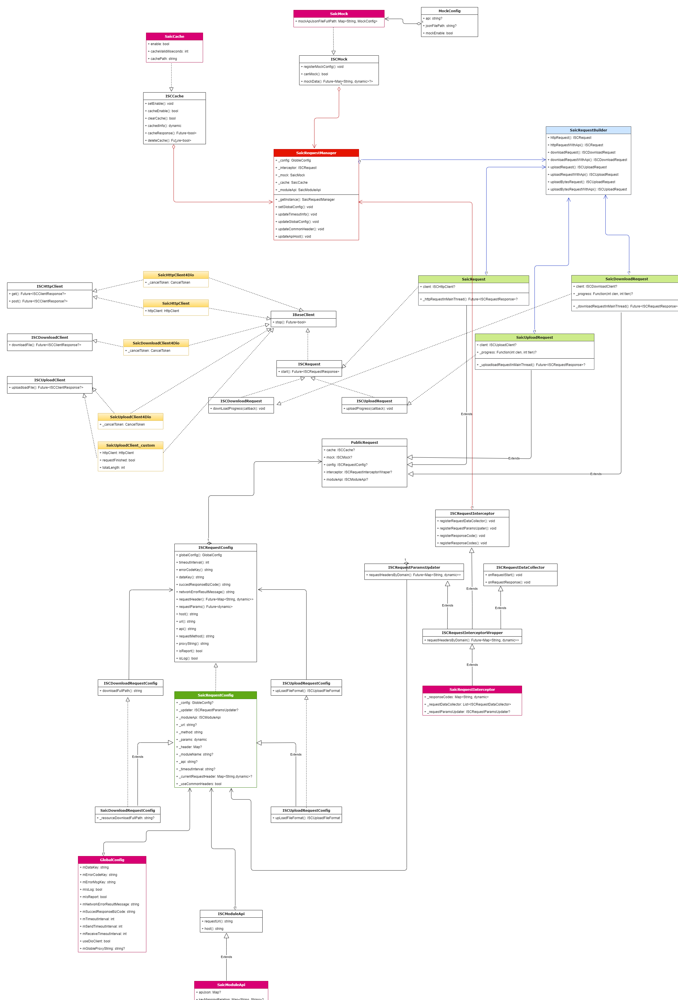
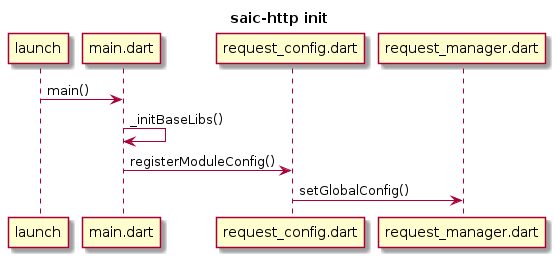
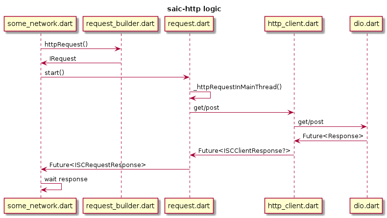

# 长连接
涉及到的lib:
	aar: xx-flutter-bridge(git: flutter_defs)
	dart: trippush、websocket、im

其中，
1. bridge是原生和flutter沟通的桥梁，封装了methodChannel-原生到flutter的调用过程；
2. trippush是flutter和原生沟通的桥梁，封装了methodChannel-flutter到原生的调用过程以及长连接实现的细节；
3. websocket是长连接通信过程的一种实现；
4. im里面正是使用长连接进行司乘会话的；

## 启动流程
1. 进程启动的时候，会执行flutter的初始化，其中`public_config.dart`配置了`WsSessionMgr`的`ClientConfig`；
2. flutter初始化完毕后，会创建长连接：`FlutterKrpcManager`向bridge注册回调，并调用init、start方法；
3. init方法除了设置了uid等参数，还建立了原生和flutter的channel；
4. bridge通过channel调用trippush的`start`方法，其实调用的是`WsSession`的`start`方法；
5. 调用`session_manager_imp.dart`的`_startConnection`，如果链接失败，这个方法默认3秒重连；
6. 调用`WsConnection`的`doConnection()`，进而调用`_doConnectionInterval()`获取`WebSocket`--通过`WebSocket.connect`创建`_webSocket`；
7. 将`_webSocket`包装到`IOWebSocketChannel`中，获取到它的`stream`，开始监听数据流，`Socket`建立完毕。

## 发送数据
这里以`getLastEvent`为例，app中除了使用轮询查询`lastEvent`，同时也可以通过`websocket`发起`lastevent`请求，直接从`trippush_imp.dart`看起：
1. 首先，`queryLastEvent`中将业务端传过来的数据转为`protolbuf`格式，调用`WsSession`的`sendMessage`方法；
2. `sendMessage`方法中，首先开始组装标准化的数据格式：`WsPackageHeader/WsPackageBody/WsPackage`，然后判断长连接链接状况，
如果长连接还没有链接，会把请求封装成`WsContext`，这个对象保存了请求/响应/消息过期/超时时间/回调等，最终存放到`_unSendContexts`这个列表中。
3. 如果长连接连接成功，首先会进行token校验，`token`校验后才会调用`WsSessionManager`的`sendPackage`方法发送消息；
4. 同样将消息包装成`WsContext`，调用`sendPackageWithContext`，仍会先判断连接状态，如果这一次判断是`false`，会立即给到一个默认的-900的response。
如果连接成功，判断该消息是否是`push`,两种消息的类型除了数据格式有差别，非push消息会处理响应，给到`callback`到发起处。
5. 最终调用`WsConnection`的`sendData`方法发送消息，实际上是调用`_webSocketChannel!.sink.add(message)`;

## 接收数据
创建`websocket`的时候，由于向`stream`注册了`listener`，所以可以监听到服务端主动发送过来的消息。具体的实现在`WsSessionManager`的`onReceiveData`方法中。
1. 接收到消息后，会将`json`解析为`WsPackage`，调用`_handleNextPackage`方法；
2. 根据`header`中的`direction`判断消息类型，如果是`request`或者`push`，如行程状态改变推送，回调到业务层后，会立即生成一个`retCode=0&direction=2`的默认响应，发送到服务端。
3. 如果`header`中的`direction=2`，是一个响应，如`getLastEvent`的结果，会把之前的请求从`_heartBeat.sendMap`中取出来，然后回调到`callback`处，最后还会校验一次`token`。

## 心跳
在启动长连接的时候，会开启一个定时器，每`1s`执行一次检查逻辑。
1. 获取当前的时间戳，对于非`im push`消息，都会缓存一份到`HeartBeat`的`sendMap`中，这里会拿时间戳和`pakcage`过期的时间`expiredTime`做对比，如果过期，则回复一个`RPC_TIMEOUT = -902`的`response`，
放弃发送该包；
2. 校验心跳发送时间，超过30s默认，会发送新的心跳包；
3. 心跳包数据结构如下：`'{"direction": 1,"serviceId": 1,"msgId": 1}'`；

## Token
`token`都是跟网关绑定的，验证`token`的时候，`header`中会包含`serviceId`。
对于长连接的踢出，我看业务中并没有去处理。校验`token`的时机有几处：
1. 客户端主动发送消息之前；
2. 收到`websocket`消息后，这里的消息是指对`request`的响应`response`，类似于主动调用`getLastEvent`；
3. 设置`token`时，`setAccessToken`；
4. 长连接连接成功后；

## 网关
1. 创建长连接时，会传入`gtwServiceId`和`pushServiceId`，这个时候会生成`TcpGtwInfo`信息，并将`gtwServiceId:TcpGtwInfo`保存到`gtws`中，将`pushServiceId：PushReceiver`保存到`_pushReceiverMap`中；
2. `TcpGtwInfo`中除了`token`字段外，还有`needReloginRetCodes`、`connectionListener`、`needNewAccessTokenReceiver`等字段；
3. 当校验`token`的时候，接收到服务端的校验结果，会比对`needReloginRetCodes`：如果是踢出登录，则会通过`needNewAccessTokenReceiver`回调；
4. `connectionListener`也是一个业务回调，会回调当前长连接的连接状态以及token的校验状态；

## 缓存机制-_unSendContexts
1. 主动向服务端发送消息时，当连接没有连接成功，会把消息缓存起来；
2. 当监听到长连接连接后，并且token验证成功后，每秒发送一条未发送成功的消息；
3. 当长连接连接失败/`token`校验失败时，会默认生成对应的错误信息，并回调`callback`；

## 重连
当创建长连接时，会注册回调，便于感知连接状态。
1. 当没有网络、没有`address`或者创建`WebSocket`异常，都会导致连接创建失败，此时会执行重试逻辑，每3s重试一次；
2. 当连接成功后，又遇到连接出错、方法调用出错、消息超时等原因，会尝试重连；
3. 连接状态发生改变时，主要处理未发送的消息。

## IM
1. `chat_config.dart`中，初始化IM模块的时候，会初始化`RpcSession`，这个`session`和消息推送不是同一个；
2. 当收到服务端推过来的消息时，会把消息入库，同时回复一个`retCode=0`的响应；
3. 当`im`发送消息时，实际上就是通过`session`的`sendMessage`方法实现的，然后等待响应；
4. 等服务端响应后，更新数据库中消息的发送/已读状态；

# 网路库
## 类图：

先看一下类图，我们从类图中能获取几点信息：

1. http主要是对`dio`/`dart_http`进行了封装，封装为满足我们业务需求的网络请求框架；
2. http使用了面向接口编程以及几种常见的设计模式，如：单例模式、工厂模式、模板模式、门面模式、组合模式等；
3. http拥有多项配置选项，如：路由配置、数据`mock`、缓存管理、请求拦截器等；
4. http的mock功能和缓存功能的实现都比较简单，并没有采用`dio`本身自带的强大缓存功能，原因可能是统一封装两种不同的请求方式；
5. http支持接口请求、文件上传、文件下载，但文件下载仅有一种实现方式；
6. http api请求支持`get`和`post`两种实现方式；
7. 上边提到，直接使用`dio`进行网络请求没有任何问题，之所以封装一下是因为对于每一个网络请求，我们不想重复配置请求，http仅是把重复的请求配置项封装起来而已；

## 流程图
**初始化流程**：

**调用流程**：

有几点需要说明：

1. 网络库的初始化是在进程启动后，flutter初始化执行`main.dart`时进行的，具体位置是`request_config.dart`文件中；
2. 初始化的时候配置了`ApiJson`、`GlobalConfig`、`Cache`、`Mock`、`Interceptor`等组件；
3. 初始化的时候有几个flutter和原生的交互，包括：
    - xx://FlutterCenter/getGlobleConfig
    - xx://FlutterCenter/getProxyString
    - xx://Http/updateGlobleConfig 环境切换的时候调用
    - xx://Http/updateCommonHeader 暂无用处
    - xx://Http/updateApiHost
4. flutter调用xx://FlutterCenter/getGlobleConfig从native拿到的是一个map，map中包含'`header`'/'`apiJson`'/'`proxy`'/'`responsecodes`'；
5. '`apiJson`'是`module`与`host`的对应关系；'`header`'就是通用的请求头；'`proxy`'就是代理，默认取wifi设置的代理，方便抓包；‘`responsecodes`’配置的是和踢出登录有关的错误码。
6. `RequestBuilder`虽然叫builder但不是构建者模式，叫`RequestFactory`更合适；
7. `RequestInterceptor`综合了拦截器，生命周期回调等功能，其中拦截器中会向外抛出根据域名设置`header`的回调；
8. 有多处设置`header`的地方，优先级由低到高的先后顺序为：
    - 初始化设置的通用`header`；
    - 对于每个请求，拦截器回调更新的`header`；
    - 对于每次请求，用户手动设置的`header`；
9. 发起网络请求之前，会先判断缓存、mock，如果都没有命中，会发起真正的网络请求；
10. 业务模块发起网络请求的时候，默认使用`dio`的实现，最终调用`dio.dart`发起网络请求；